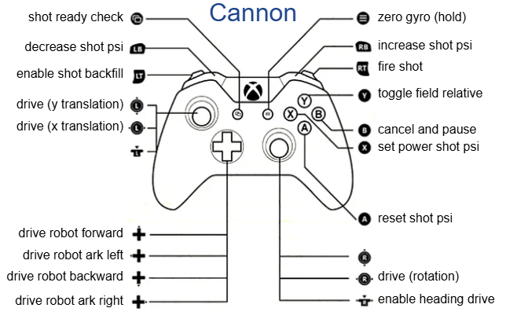
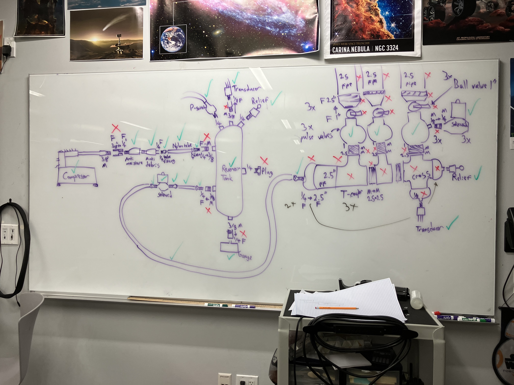

# T-Shirt Cannon

This project contains robot code for 8032's T-Shirt cannon robot. This robot was built created preseason of 2025.

  

## Driving and operating controls
We chose to go with a single controller scheme for driver convince.

* Normal swerve drive controls with joysticks, plus D-Pad for robot relative forward/backwards and ark strafe left/right
* The bumpers will increase/decrease the target shot PSI by 5.0
* The A button resets the target shot PSI to 50.0 and X sets it to the long shot default of 70.0
* Right trigger to shoot T-shirt with shottank. Left and right trigger to fire T-shirt with shot tank and reserve tank
* Defaults to field relative drive, but can use Y to toggle field relative on/off. Holding the start button (3 lines button) will reset the field relative forward (0) direction to the robot's current heading
* Holding the menu button (two squares button) will vibrate the controller lightly if the shot tank is in tolerance of target PSI, and also turn the LEDs red to show it is ready to fire

#### Rumbles
Controller rubles let the driver get important feedback quickly. Here are what they mean.
* There will be a small medium lenght rumble when shot tank gets in tolerance of target pressure
* There will be a variable rumble the entire time the cannon is firing, with the left side intensity based on shot tank power and right side intensity based on reserve tank power
* There will be a small short rumble to confirm field relative has been reset
* If the menu button is held amd the shot tank is within tolerance of the target PSI and the controller will rumble

#### LEDs
The LEDs are mostly for audience viewing experience. Here the the different modes
* Red: Loaded (Has to be turned on manfully with )
* Green: Default, Unloaded
* Flashing Yellow/White: Firing

## Simulation
* Simulation is key to making sure control logic is safe and correct, and controls act as expected. Although PSI changes are largely incorrect they still roughly mimic real behavior. The video below shows the robot simulation in AdvantageScope with pneumatics sim data in Shuffleboard.

https://github.com/user-attachments/assets/d6b8d52f-94d8-4c34-9652-7c8a6fbbd129

## Pneumatics
Please see the ControlConstants.java file for key control variables.

